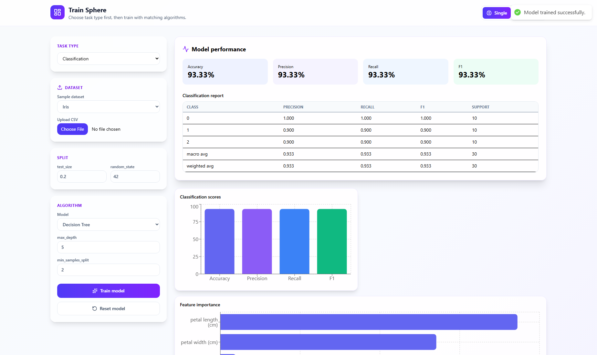
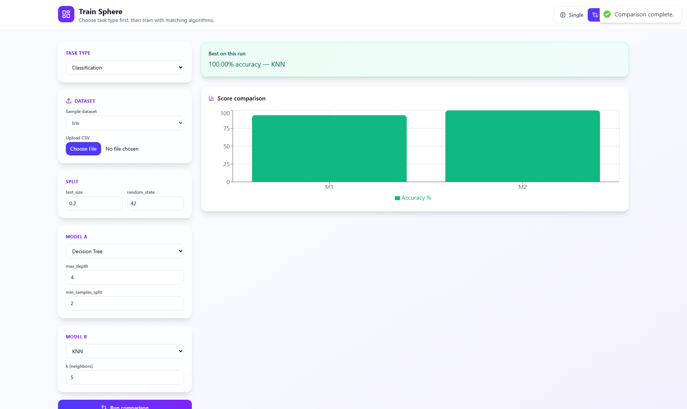

# Train Sphere

A full-stack web application for training and comparing classical machine-learning classifiers powered by **scikit-learn**, **Flask**, and **React (Vite)** with **Tailwind CSS**, **Recharts**, **lucide-react**, and **react-hot-toast**.

## Project overview

The app lets you:

- Choose **Decision Tree**, **K-Nearest Neighbors (KNN)**, or **Naive Bayes (GaussianNB)**.
- Train on the built-in **Iris** or **Wine** datasets, or **upload your own CSV** (numeric features; target in the **last column**, or specify `target_column` in API requests).
- Tune algorithm-specific parameters and **re-run** training instantly.
- View **accuracy**, **weighted precision / recall / F1**, a full **classification report** (per-class and averages), **confusion matrix** heatmap, **feature importance** (Decision Tree), an optional **ROC curve** (binary classification only), and a **decision boundary** plot (first two features, Matplotlib on the server).
- Use **Compare two models** so both algorithms are evaluated on the **same train/test split** (fair comparison), with a clear **“best on this run”** banner.
- After training in **Single model** mode, use **single input prediction**: dynamic fields for each feature, **Predict single input** calls `POST /predict`, and the UI shows a highlighted **Predicted class** card.
- **Reset model** clears the server-side trained model and disables prediction until you train again.

## Sample GUI results

These screenshots show Train Sphere running on the built-in **Iris** classification dataset with `test_size = 0.2` and `random_state = 42`.

### Single model training

Example setup:

- **Task type:** Classification
- **Dataset:** Iris
- **Model:** Decision Tree
- **Parameters:** `max_depth = 5`, `min_samples_split = 2`

Result shown in the GUI:

| Metric | Score |
|--------|-------|
| Accuracy | 93.33% |
| Precision | 93.33% |
| Recall | 93.33% |
| F1 | 93.33% |



### Two-model comparison

Example comparison setup:

- **Task type:** Classification
- **Dataset:** Iris
- **Model A:** Decision Tree (`max_depth = 4`, `min_samples_split = 2`)
- **Model B:** KNN (`k = 5`)
- **Same split:** `test_size = 0.2`, `random_state = 42`

Result shown in the GUI:

| Model | Accuracy |
|-------|----------|
| Decision Tree | 93.33% |
| KNN | 100.00% |

**Best on this run:** KNN with **100.00% accuracy**.



## Requirements

- **Python** 3.10+ (recommended)
- **Node.js** 18+ and npm

## How to run

### Backend (Flask)

```bash
cd backend
python -m venv .venv
.venv\Scripts\activate          # Windows
# source .venv/bin/activate       # macOS / Linux
pip install -r requirements.txt
python app.py
```

The API listens on **http://127.0.0.1:5000** by default.

Endpoints:

| Method | Path             | Description |
|--------|------------------|-------------|
| GET    | `/health`        | Health check |
| GET    | `/datasets`      | Lists sample dataset keys (`iris`, `wine`) |
| GET    | `/model/status`  | Whether a model is loaded; feature & target names |
| POST   | `/train`         | Train one model (JSON or multipart with CSV file); stores the fitted model for `/predict` |
| POST   | `/compare`       | Train multiple models on the **same** split |
| POST   | `/predict`       | Single-row prediction: body `{ "input": [f1, f2, ...] }` → `{ "success": true, "prediction": "class_name" }` |
| POST   | `/reset`         | Clear stored model state |

### Frontend (React + Vite)

```bash
cd frontend
npm install
npm run dev
```

Open **http://127.0.0.1:5173**. The dev server proxies `/api/*` to the Flask app so the UI calls `/api/train`, `/api/compare`, `/api/predict`, etc. without CORS issues.

**Production build:**

```bash
cd frontend
npm run build
npm run preview
```

To point the UI at a Flask server on another host/port, create `frontend/.env`:

```env
VITE_API_URL=http://127.0.0.1:5000
```

(If unset, the app uses `/api` and expects a dev proxy or reverse proxy.)

## Classification metrics (what the API returns)

Alongside **accuracy** (fraction of correct predictions on the hold-out test set), the training and comparison flows return:

- **`classification_report`** — scikit-learn’s report as a JSON-friendly dict: for each class (and for **macro avg** / **weighted avg** rows where applicable), **precision**, **recall**, **F1-score**, and **support** (number of true instances of that class in `y_test`).
- **`precision_score`**, **`recall_score`**, **`f1_score`** — here computed with **`average='weighted'`** so each class contributes in proportion to its support. This gives a single summary number that reflects class imbalance better than a plain unweighted mean.
- **Interpretation (short):**
  - **Precision**: of everything the model labeled as class *c*, how many were actually *c*? (quality of positive predictions for that class.)
  - **Recall**: of all true instances of class *c*, how many did the model find?
  - **F1**: harmonic mean of precision and recall; balances the two.

The dashboard also charts precision, recall, and F1, and tabulates the full report for deeper inspection (per-class behavior, support, averages).

## Algorithm explanations (scikit-learn)

### Decision Tree (`DecisionTreeClassifier`)

A tree of if/else rules on feature thresholds. **max_depth** limits how deep the tree grows (reduces overfitting). **min_samples_split** requires a minimum number of samples to split a node. Good interpretability; can overfit if depth is too high. **Feature importance** is taken from the fitted tree when this algorithm is used.

### K-Nearest Neighbors (`KNeighborsClassifier`)

Classifies a point by majority vote among the **k** closest training examples in feature space. **k** trades bias and variance: small **k** can be noisy; large **k** smooths boundaries. Assumes locally similar points share labels; feature scaling can matter for real data (this demo uses raw features as loaded).

### Naive Bayes — Gaussian (`GaussianNB`)

Assumes features are conditionally independent given the class and uses Gaussian likelihoods for continuous features. Fast, works well on many problems with little tuning; the GUI uses default hyperparameters.

## GUI highlights

- **Dashboard layout**: left sidebar (dataset, split, algorithm, train / reset), main panel (metrics, charts, prediction).
- **Visual polish**: gradient background, elevated cards, hover transitions, **lucide-react** icons, **loading skeletons** while training, **fade-in** when results appear, **toasts** for success and errors.
- **Charts (Recharts)**: confusion matrix heatmap, per-run accuracy bar, precision/recall/F1 bars, training-run accuracy history (after multiple single-model trains), decision-tree feature importance, optional ROC/AUC for **binary** problems.
- **Single input prediction**: enabled only after a successful **Train model** (server stores the estimator). **Compare** mode does not replace that stored model; train single-model again to refresh `/predict`.
- **Reset model**: clears the server model and UI state for a clean run.

## Screenshots

The README screenshots are stored in `docs/screenshots/`:

- `docs/screenshots/train-sphere-single-results.png` - Iris Decision Tree training output.
- `docs/screenshots/train-sphere-model-comparison.png` - Iris Decision Tree vs KNN comparison output.

## Project structure

```
.
├── backend/          # Flask app, ml_engine.py (training, metrics, plots)
├── frontend/         # Vite + React + Tailwind + Recharts
└── README.md
```

## License

Educational / demonstration use.
